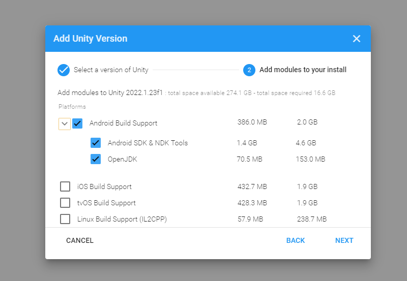
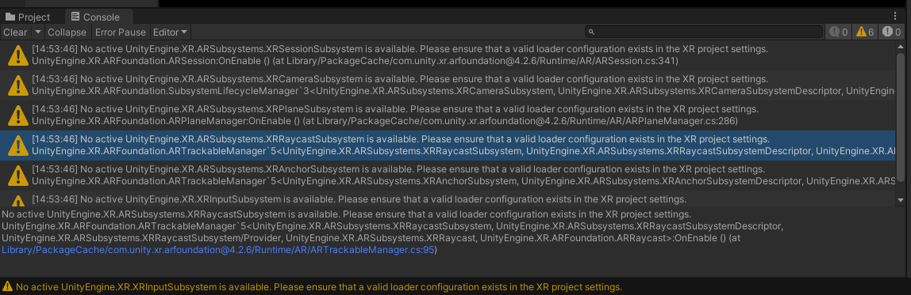
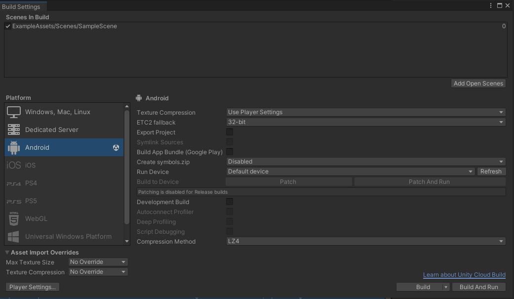
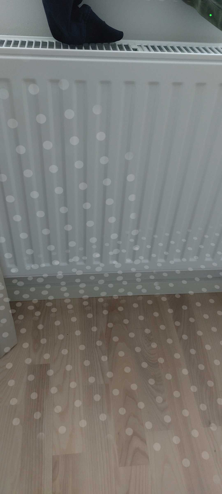

# Augmented Reality med Unity

I det här projektet ska vi lära oss augmented reality med Unity.  
Vi kommer börja med grunderna i Augmented Reality och applicera dessa på övningsprojekt.  
Därefter kommer Hubbla projektet introduceras, det är ett samarbetsprojekt med Västmanlands Region och företaget Mindflower.

- <a href="https://hubbla.se/">https://hubbla.se/</a>
- <a href="https://mindflower.se/">https://mindflower.se/</a>

Mindflower kommer tillhandahålla ett Unity skalprojekt som utgångspunkt för ert projekt.

## DEL 1. Resurser att gå igenom

### DEL 1.1 Sätta upp miljön

När man jobbar med AR i Unity så gör man det med antingen AR-Foundation eller Vuforia.
Vi ska använda AR-Foundation.

Börja med att gå igenom det här klippet och följ instruktionerna genom att skapa en AR app utifrån AR mall projektet som Unity ger.
Jag har testat att det fungerar på 2022.1.23f1. Vill man vara säker installera den versionen.

<a href="https://www.youtube.com/watch?v=FWyTf3USDCQ&list=PLKUARkaoYQT2ocXRGzwfXtGVpG8ewwa3Y&index=1">https://www.youtube.com/watch?v=FWyTf3USDCQ&list=PLKUARkaoYQT2ocXRGzwfXtGVpG8ewwa3Y&index=1</a>

När man skapat ett projekt dyker det upp ett antal varningar men ignorera dessa:

Det går inte att testa appen i Unity direkt utan man behöver använda en Android telefon som har stöd för Augmented Reality. Telefonen måste även vara i utvecklarläge vilket man ställer in i inställningar, kolla på den här: <a href="https://www.samsung.com/uk/support/mobile-devices/how-do-i-turn-on-the-developer-options-menu-on-my-samsung-galaxy-device/">https://www.samsung.com/uk/support/mobile-devices/how-do-i-turn-on-the-developer-options-menu-on-my-samsung-galaxy-device/</a>  
Bocka också i USB-felsökning men tror inte det är ett krav.

Nu ska du kunna bygga och köra appen på din telefon efter kopplat den till datorn med usb-kabel.
Gå till Build Settings via File -> Build Settings och klicka på knappen i nedre högra hörnet som heter **Build And Run**.

Din app ska nu köras på din telefon och kameran ska vara på, det skapar lite vita cirklar när man rör på skärmen.

Tyvärr måste man göra så här varje gång man vill testa sin app efter sina ändringar.

### DEL 1.2 Lära sig grunderna

Gå därefter igenom följande 4 tutorials om Unity med AR-Foundation, hoppa över delarna som är redan gjorda i 1.1:

- <a href="https://www.andreasjakl.com/ar-foundation-fundamentals-with-unity-part-1/">https://www.andreasjakl.com/ar-foundation-fundamentals-with-unity-part-1/</a>
- <a href="https://www.andreasjakl.com/trackables-and-managers-in-ar-foundation-part-2/">https://www.andreasjakl.com/trackables-and-managers-in-ar-foundation-part-2/</a>
- <a href="https://www.andreasjakl.com/raycast-anchor-placing-ar-foundation-holograms-part-3/">https://www.andreasjakl.com/raycast-anchor-placing-ar-foundation-holograms-part-3/</a>
- <a href="https://www.andreasjakl.com/2d-image-tracking-with-ar-foundation-part-4/">https://www.andreasjakl.com/2d-image-tracking-with-ar-foundation-part-4/</a>

Där efter ska ni gå igenom följande Youtube serie som använder Vuforia istället för AR-Foundation och återskapa någon av apparna där med AR-Foundation. Så ni ska kolla hur han gör men inte göra samma sak i Vuforia utan med AR-Foundation.  
Videoserien är på 11h och 39 min, men första 6h och 25 min är genomgång av C# som vi redan gjort, känner man sig ringrostig i C# får man gärna gå igenom det också. I videon skapas några enklare AR-appar som är bra att göra själv för att komma i gång med grunderna i AR med Unity men med AR-Foundation istället för Vuforia.

- <a href="https://www.youtube.com/watch?v=WzfDo2Wpxks">https://www.youtube.com/watch?v=WzfDo2Wpxks</a> 
- <a href="https://arcourse.netlify.app/index.html">https://arcourse.netlify.app/index.html</a> 

En liten labb om man vill gå igenom men inte obligatorisk:

- <a href="https://codelabs.developers.google.com/arcore-unity-ar-foundation#0">Code Labs</a>

Tycker man det är för trixigt med upplägget ovan kan man försöka hitta andra tutorials med Unity och AR-Foundation.

## DEL 2. Välja digital miljö att skapa

I del 2 så ska vi applicera våra kunskaper i ett projekt där vi skapar en digital upplevelse inom ramen kultur, gamification, historia och samhälle.  
Det är i samarbete med Västmanlands Region och företaget Mindflower. De kommer hålla en introduktion på skolan direkt efter påsklovet måndag 6/3 kl 14:35.

Projektet utförs i grupper. Vi har gjort projektet med 200S tidigare. Här är exempel på upplevelser som de skapade.

<a href="https://www.svt.se/nyheter/lokalt/vastmanland/gymnasieelever-pitchade-ar-upplevelser-for-ny-app
">https://www.svt.se/nyheter/lokalt/vastmanland/gymnasieelever-pitchade-ar-upplevelser-for-ny-app</a>

Vi vill att ni jobbar vidare med Kanban och Github-flow i det här projektet också.

Avslutningen kommer vara nere på stan Karlsgatan 2 där museumet ligger bredvid Melkerhuset och Skrapan.  
Där får ni hålla presentationer och vi brukar ha gemensam lunch innan på hotell Plaza.
